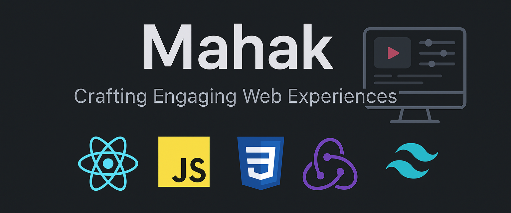

<h1 align='center'>

</h1>

<!-- <h1 align='center'>
  
</h1> -->

### 👩‍💻 About Me

- 💼 **Software Engineer** with experience building **production-ready software systems** and **API-driven applications**
- ⚙️ Strong in **JavaScript, React.js, Redux, HTML, CSS, Python, REST APIs, Flask, and system design fundamentals**
- 🌐 Experience across **frontend + backend**, delivering scalable features in real-world products
- 📊 Worked on **large datasets, analytics workflows, and performance optimization**
- 🚀 Passionate about **problem solving, DSA, and scalable software architecture**
- 🤝 Open to **Software Engineer / Full Stack opportunities & collaborations**

📫 **Reach me:** **mahak1923k@gmail.com**

---

## 🔗 Connect With Me

      
  
## 🧠 Technical Skills

### 💻 Languages
 
---

### 🌐 Frontend
    

---

### ⚙️ Backend & Databases
    

---

### ☁️ Cloud & Dev Tools
 
    

---

### 🧩 Computer Science Fundamentals
     
 

## 📝 Latest Blog Posts
- [Python Pyramid – HTML Form Template](https://www.geeksforgeeks.org/python-pyramid-html-form-template)
- [Machine Learning in Cyber Security: Applications and Challenges](https://www.geeksforgeeks.org/ml-in-cyber-security/) 

## 📈 GitHub Stats 

